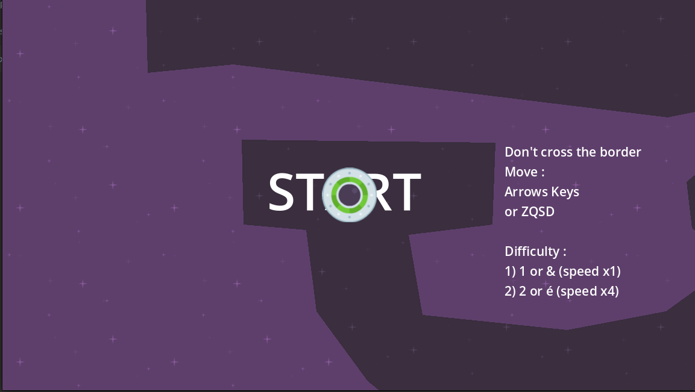

# Speedy Saucer

  This game was create by following the course on gamedev.tv "Complete Godot 4 2D: Code Your Own 2D Games In Godot 4!"

## Objective 
    
  Navigate through the maze without crossing its borders.
  

## Control 

### Movement 
    Arrow Key
    ZQSD

### Difficulty 
    & or 1 = Speed x1
    é or 2 = Speed x4

## Available 
     Windows
     Linux
## Download  
  [Speedy Saucer(Window)](https://github.com/Elkantar/SpeedySaucer/releases/download/Update_1.0.2/Speedy_Saucer_Win.zip)  
	[Speedy Saucer(Linux)](https://github.com/Elkantar/SpeedySaucer/releases/download/Update_1.0.2/Speedy_Saucer_linux.zip)
